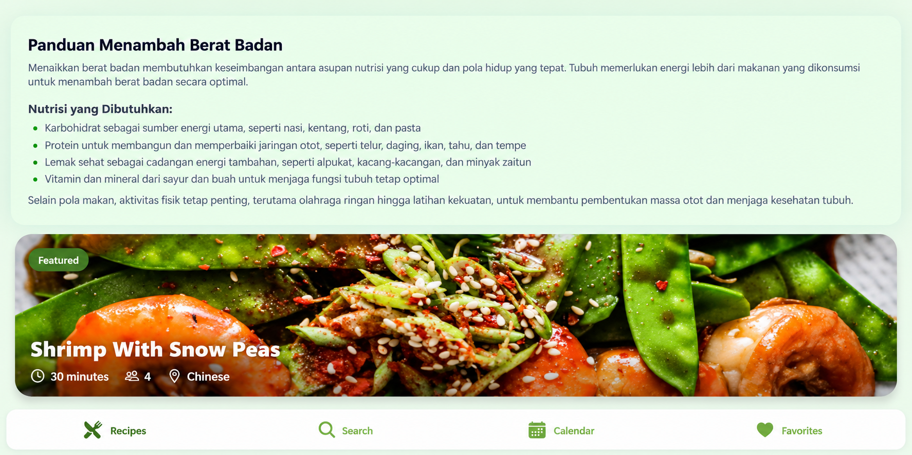

# MyFood+ — Recipe Recommendation & Meal Planning App

MyFood+ is a mobile recipe discovery and meal planning application developed as an academic group project. The application helps users explore recipes, search for meals, view detailed cooking information, plan meals through a calendar, and manage favorite recipes.

The project combines a React Native mobile interface, a Node.js and Express backend, PostgreSQL database integration using Neon, TheMealDB API, and a basic machine learning component for meal classification.

## App Preview

## Features

- Browse and discover recipes
- Search recipes by keyword
- View detailed recipe information
- Filter recipes by category
- View featured recipes
- Save favorite recipes
- Calendar-based meal planning
- Integration with TheMealDB API
- PostgreSQL database integration
- Basic machine learning-based meal classification

## Tech Stack

### Frontend
- React Native
- Expo
- Expo Router
- JavaScript
- Axios

### Backend
- Node.js
- Express.js
- Drizzle ORM
- Python Shell

### Database
- PostgreSQL
- Neon

### Machine Learning
- Python
- Pandas
- Scikit-learn
- Joblib

### External API
- TheMealDB API

## Project Structure

    myfood-plus/
    ├── backend/
    │   ├── ml/
    │   │   ├── meal_classifier.pkl
    │   │   └── predict.py
    │   ├── src/
    │   │   ├── config/
    │   │   ├── db/
    │   │   ├── routes/
    │   │   └── server.js
    │   ├── package.json
    │   └── drizzle.config.js
    │
    ├── mobile/
    │   ├── app/
    │   ├── assets/
    │   ├── components/
    │   ├── constants/
    │   ├── context/
    │   ├── hooks/
    │   ├── services/
    │   ├── utils/
    │   └── package.json
    │
    ├── screenshots/
    │   └── home.png
    │
    ├── .gitignore
    └── README.md

## Application Flow

The mobile application retrieves recipe information from TheMealDB API.

The backend handles application services such as favorites and database operations, while PostgreSQL hosted on Neon is used to store favorite recipe data.

    React Native / Expo
            │
            ├── TheMealDB API
            │
            └── Node.js / Express Backend
                        │
                        ├── PostgreSQL / Neon
                        │
                        └── Python ML Model

## Backend API

The backend runs locally on:

    http://localhost:5001

Available endpoints include:

    GET    /api/health
    POST   /api/favorites
    GET    /api/favorites/:userId
    DELETE /api/favorites/:userId/:recipeId
    POST   /predict

### Health Check

    GET /api/health

Example response:

    {
      "success": true
    }

## Database

MyFood+ uses PostgreSQL hosted on Neon.

The `favorites` table stores information such as:

- User ID
- Recipe ID
- Recipe title
- Recipe image
- Cook time
- Servings
- Category
- Ingredient count
- Instruction length
- Creation timestamp

Database credentials are stored locally using environment variables and are not included in this repository.

## Installation

### 1. Clone the Repository

    git clone https://github.com/ayundini586/myfood-plus.git

Enter the project directory:

    cd myfood-plus

## Backend Setup

Navigate to the backend directory:

    cd backend

Install dependencies:

    npm install

Create a `.env` file inside the backend directory:

    DATABASE_URL=your_postgresql_connection_string

Start the backend:

    npm start

The backend should run on:

    http://localhost:5001

To check whether the backend is running:

    http://localhost:5001/api/health

## Mobile App Setup

Open another terminal and navigate to the mobile directory:

    cd mobile

Install dependencies:

    npm install

Start Expo:

    npm start

For web testing:

    npm run web

The Expo web application typically runs on:

    http://localhost:8081

## Testing

Manual smoke testing was performed on the main application flows.

| Feature | Result |
| --- | --- |
| Recipes / Home | Working |
| Recipe Search | Working |
| Recipe Detail | Working |
| Calendar | Working |
| Backend Health API | Working |
| PostgreSQL / Neon Connection | Working |
| Favorites API - Add | Working |
| Favorites API - Retrieve | Working |
| Favorites Mobile Integration | Local environment issue |

The backend Favorites API was independently tested by adding and retrieving recipe data from the Neon PostgreSQL database.

## Known Limitation

The Favorites backend API and PostgreSQL integration work when tested independently.

However, the current local development environment has a compatibility issue in the machine learning integration involving the Python/NumPy environment. This can affect the Favorites flow from the mobile interface.

The main recipe browsing, search, recipe detail, calendar, backend API, and database functionality can still be tested independently.

## My Contribution

### Testing & Debugging

My contribution to this group project focused on testing and debugging the application.

My responsibilities included:

- Testing the main application flows
- Testing recipe browsing, search, recipe details, calendar, and favorites
- Testing backend API endpoints
- Verifying backend and PostgreSQL connectivity
- Testing data insertion and retrieval through the Favorites API
- Identifying frontend-backend integration issues
- Identifying local Python and machine learning environment compatibility issues
- Assisting with project validation and documentation before preparing the project for portfolio presentation

## Team

This project was developed collaboratively by a team of five members as an academic project.

### Team Members

1. Ayundini Nursyahrin A. M.
2. Felicia Pardamean
3. Hani Huwaida Arista
4. Jovita Niken A. P.
5. Silva Yunisa N.

## Security

Sensitive configuration files are excluded from the repository using `.gitignore`.

The following files should never be committed:

    .env
    node_modules/

Database passwords and Neon connection strings should remain private.

## Repository

GitHub:

    https://github.com/ayundini586/myfood-plus

## Project Type

Academic Group Project